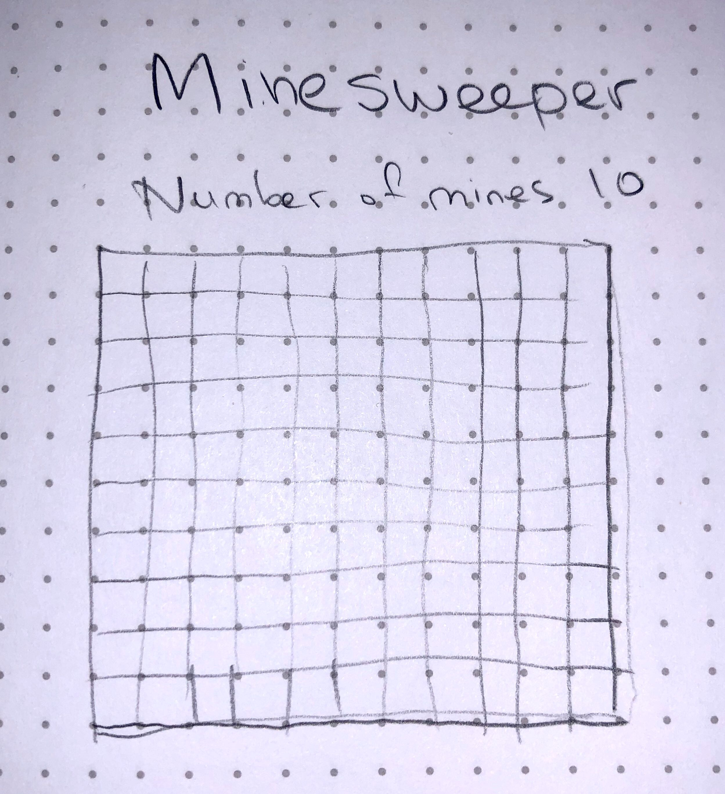

Minesweeper

SEI CC07 Bahram Movlanov
Project 1 



#### Pseudocode
``` //  1. Initialize game
            1.1. Setup board
            1.2. Populate mines
            1.3. Render
        
[My awsome Minesweeper](https://movlan.github.io/SEI-project-1-Minesweeper/)

