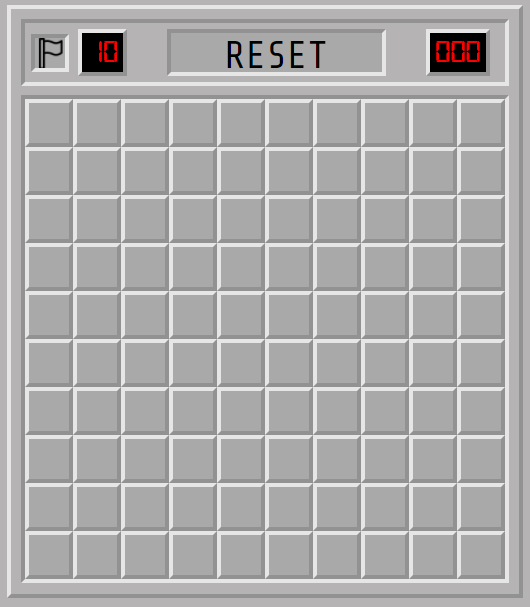

# Minesweeper

SEI CC07 Bahram Movlanov
Project 1




#### Pseudocode

```// 1. Initialize game
            1.1. Setup board
            1.2. Populate mines
            1.3. Render
```

[My awesome Minesweeper](https://movlan.github.io/Minesweeper/)
